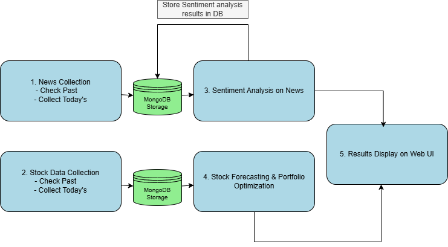

# Low-Level Design Document - MLOps AI Financial Application

## 1. Component Specifications

### 1.1 Web Application (Flask)

#### API Endpoints

| Endpoint                   | Method | Description                          | Request Parameters                        | Response Format                         |
| -------------------------- | ------ | ------------------------------------ | ----------------------------------------- | --------------------------------------- |
| `/`                        | GET    | Main application page                | None                                      | HTML                                    |
| `/api/search`              | GET    | Search stocks by name or ticker      | `q`: search query (string)                | JSON array of matching stocks           |
| `/api/stock/<ticker>`      | GET    | Get stock data for a specific ticker | `period`: time range (1w, 1m, 3m, 6m, 1y) | JSON with historical price data         |
| `/api/portfolio`           | GET    | Get optimal portfolio allocation     | None                                      | JSON with asset allocations and metrics |
| `/api/sentiment/<ticker>`  | GET    | Get sentiment analysis for a ticker  | None                                      | JSON with sentiment scores and trends   |
| `/api/prediction/<ticker>` | GET    | Get price predictions for a ticker   | None                                      | JSON with predicted prices              |

#### Data Models

**Stock Data:**

```json
{
  "name": "AAPL",
  "ticker": "AAPL",
  "current_price": 150.25,
  "daily_change": 2.75,
  "daily_change_percent": 1.86,
  "history": {
    "dates": ["2023-01-01", "2023-01-02", ...],
    "prices": [145.50, 147.25, ...]
  }
}
```

**Portfolio Allocation:**

```json
{
  "allocations": [
    {"ticker": "AAPL", "allocation": 0.25},
    {"ticker": "MSFT", "allocation": 0.20},
    ...
  ],
  "metrics": {
    "sharpe_ratio": 1.5,
    "expected_return": 0.12,
    "volatility": 0.08
  }
}
```

**Sentiment Analysis:**

```json
{
  "ticker": "AAPL",
  "company_name": "Apple Inc.",
  "overall_sentiment": "positive",
  "sentiment_score": 0.75,
  "weekly_trend": [
    {"week_start": "2023-01-01", "score": 0.65},
    {"week_start": "2023-01-08", "score": 0.70},
    ...
  ],
  "article_count": 24
}
```

**Price Prediction:**

```json
{
  "ticker": "AAPL",
  "current_price": 150.25,
  "predictions": [
    {"date": "2023-02-01", "price": 152.50},
    {"date": "2023-02-02", "price": 153.75},
    ...
  ],
  "model_confidence": 0.85
}
```

## 2. System Pipeline

The following diagram illustrates the end-to-end data flow across all components of the system:


_End-to-end data and processing flow between system components_

### 2.1 Data Ingestion (Airflow)

#### DAG: `stock_data_collection`

**Schedule:** Daily at 6 PM EST (11 PM IST)

**Tasks:**

1. `check_database_empty`: Verifies if initial data load is required
2. `fetch_historical_<company>`: Retrieves 6 months of historical data (if needed)
3. `fetch_daily_<company>`: Retrieves latest daily stock price

**Data Source:**

- MarketStack API (http://api.marketstack.com/v1/eod)

**Data Storage:**

- MongoDB Collection: `stock_prices`
- Document Schema:
  ```json
  {
    "company": "AAPL",
    "date": "2023-01-01T00:00:00Z",
    "stock_price": 150.25
  }
  ```

## 3. Model Training Pipeline

The training pipeline for the machine learning models follows this process:


_Model training workflow from data preparation to deployment_

### 3.1 Portfolio Optimization Service

#### Input Specifications

- **Data Source:** MongoDB collection `stock_prices`
- **Parameters:**
  - Time period for optimization (default: last 30 days)
  - Risk tolerance level (implied by optimization algorithm)

#### Output Specifications

- **MongoDB Collection:** `portfolio_optimization.models`
- **Document Schema:**
  ```json
  {
    "symbols": ["AAPL", "MSFT", "GOOGL", ...],
    "weights": [0.25, 0.20, 0.15, ...],
    "sharpe_ratio": 1.5,
    "portfolio_return": 0.12,
    "portfolio_volatility": 0.08,
    "training_date": "2023-01-15T00:00:00Z"
  }
  ```

#### Algorithm Details

- Modern Portfolio Theory optimization
- Objective: Maximize Sharpe ratio (risk-adjusted return)
- Constraints: Sum of weights equals 1.0, no negative weights (no shorting)

### 3.2 Sentiment Analysis Service

#### Input Specifications

- **Data Source:** MongoDB collection `company_news`
- **Document Schema:**
  ```json
  {
    "company": "Apple Inc.",
    "headline": "Apple Reports Record Earnings",
    "content": "Full article text...",
    "date": "2023-01-15T00:00:00Z"
  }
  ```

#### Output Specifications

- **Updates existing documents with:**
  ```json
  {
    "sentiment": {
      "label": "POSITIVE",
      "score": 0.85
    }
  }
  ```

#### Algorithm Details

- Uses Hugging Face's DistilBERT model fine-tuned on SST-2 dataset
- Binary classification (POSITIVE/NEGATIVE) with confidence score
- Processes articles without existing sentiment scores

### 3.3 Stock Prediction Service

#### LSTM Architecture

The stock prediction service uses a sophisticated LSTM neural network architecture:


_LSTM neural network architecture with hyperparameters for stock price prediction_

#### Input Specifications

- **Data Source:** MongoDB collection `stock_prices`
- **Parameters:**
  - Sequence length: 100 days
  - Prediction horizon: 14 days

#### Output Specifications

- **MongoDB Collection:** `stock_predictions`
- **Document Schema:**
  ```json
  {
    "company": "AAPL",
    "predicted_price": 152.5,
    "date": "2023-02-01T00:00:00Z",
    "model": "LSTM",
    "created_at": "2023-01-15T00:00:00Z"
  }
  ```

#### Algorithm Details

- LSTM neural network for price prediction
- Data preprocessing: MinMaxScaler normalization
- Training approach: Sliding window with sequence length 100

## 4. Database Design

### 4.1 MongoDB Collections

| Collection Name                 | Purpose                             | Key Fields                                  | Indexes         |
| ------------------------------- | ----------------------------------- | ------------------------------------------- | --------------- |
| `stock_prices`                  | Store historical stock prices       | company, date, stock_price                  | (company, date) |
| `company_news`                  | Store news articles with sentiment  | company, headline, content, date, sentiment | (company, date) |
| `stock_predictions`             | Store price predictions             | company, date, predicted_price              | (company, date) |
| `portfolio_optimization.models` | Store portfolio optimization models | symbols, weights, sharpe_ratio              | (training_date) |

## 5. Deployment Configuration

### 5.1 Docker Containers

| Service                  | Image                 | Ports     | Volumes                                                       | Environment Variables              |
| ------------------------ | --------------------- | --------- | ------------------------------------------------------------- | ---------------------------------- |
| `web-app`                | Flask application     | 5000:5000 | ./Web App:/app, ./Web App/logs:/app/logs                      | MONGO_URI, TZ                      |
| `portfolio-optimisation` | Custom Python image   | -         | ./Model Inference/portfolio optimisation:/app                 | MONGO_URI, TZ                      |
| `sentiment-analysis`     | Python + Transformers | -         | ./Model Inference/sentiment-analysis/scripts:/app/scripts     | MONGO_URI, TZ                      |
| `stock-prediction`       | PyTorch + Python      | -         | ./Model Inference/stock prediction/inference:/app             | MONGO_URI, TZ                      |
| `data-ingestion`         | Apache Airflow        | 8080:8080 | ./Data Ingestion/stock data collection/dags:/opt/airflow/dags | MONGO_URI, MARKETSTACK_API_KEY, TZ |

### 5.2 Network Configuration

All services communicate through Docker's internal network.

- MongoDB connection string: `mongodb://host.docker.internal:27017/`
- Inter-service communication: via service names (e.g., `http://web-app:5000`)

## 6. Error Handling and Logging

### 6.1 Logging Configuration

All services use a consistent logging pattern:

- Log files stored in service-specific `logs` directories
- Log format: `%(asctime)s - %(name)s - %(levelname)s - %(message)s`
- Log levels: INFO for normal operation, ERROR for issues
- Timestamps in local timezone (Asia/Kolkata)

### 6.2 Error Handling Strategies

| Error Type                 | Handling Strategy                                         |
| -------------------------- | --------------------------------------------------------- |
| API connection failures    | Retry with exponential backoff                            |
| Database connection issues | Graceful degradation with local file fallback             |
| Missing data               | Default values or placeholders with warning logs          |
| Model inference errors     | Skip problematic entries, log errors, continue processing |

## 7. Performance Considerations

### 7.1 Database Performance

- Indexes on frequently queried fields (company, date)
- Date range queries optimized with compound indexes
- Bulk operations used for batch inserts

### 7.2 API Performance

- Caching of frequent API responses
- Pagination for large result sets
- Asynchronous processing for long-running operations

## 8. Security Measures

- Environment variables for sensitive configuration
- No hardcoded credentials in code
- API rate limiting to prevent abuse
- Input validation on all API endpoints

## 9. Monitoring and Alerting

Grafana and Prometheus setup (optional component):

- System metrics: CPU, memory, disk usage
- Application metrics: API response times, error rates
- Custom metrics: Prediction accuracy, model confidence

This document provides detailed specifications of all components, their interactions, and the data they process, serving as a reference for implementation and maintenance.
