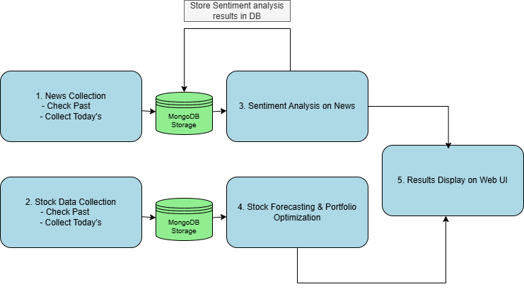

# MLOps AI Financial Application

**Author:** Achyutha Munimakula PH21B004 & Shiva Surya PH21B009

## Overview

This repository contains an MLOps-enabled AI application for financial analysis, portfolio optimization, and stock prediction. The system integrates multiple machine learning models to provide insights for investment decision-making through a unified web interface.


_System Pipeline Overview: End-to-end data flow and component interactions_

## Repository Structure

```
MLOps_AI_App/
├── Web App/               # Flask web application for user interface
├── Model Inference/       # Machine learning model inference services
│   ├── portfolio optimisation/  # Portfolio allocation optimization model
│   ├── sentiment-analysis/      # Financial news sentiment analysis model
│   └── stock prediction/        # Stock price prediction models
├── Data Ingestion/        # Data collection and processing pipelines
│   └── stock data collection/   # Stock price data collection via Airflow
├── Monitoring/            # System monitoring and visualization
├── Diagrams/              # System architecture and model diagrams
├── docker-compose.yml     # Container orchestration configuration
├── HIGH_LEVEL_DESIGN.md   # High-level system architecture design
├── LOW_LEVEL_DESIGN.md    # Low-level technical specifications
└── README.md              # This file
```

## Component Descriptions

### Web App

A Flask-based web application that provides the user interface for visualizing financial data, predictions, and portfolio recommendations. It exposes RESTful APIs for accessing the underlying ML models.

### Model Inference

Contains three specialized ML services:

- **Portfolio Optimisation**: Implements modern portfolio theory to generate optimal asset allocations


_Portfolio optimization process flow from configuration to optimal weights_

- **Sentiment Analysis**: Analyzes financial news using NLP to determine market sentiment
- **Stock Prediction**: Uses LSTM/GRU neural networks to forecast future stock prices


_LSTM Architecture: Neural network design for stock price prediction with hyperparameters_

### Data Ingestion

Contains data collection pipelines implemented with Apache Airflow:

- **Stock Data Collection**: Automatically fetches historical and daily stock price data from financial APIs

### Monitoring

Includes Grafana dashboards and Prometheus configurations for monitoring system performance, resource utilization, and model metrics.

## Training Pipeline

The system includes a comprehensive training pipeline for the machine learning models:


_Model Training Pipeline: Data preprocessing, model training, and evaluation workflow_

## Documentation

This repository includes detailed documentation to help you understand and extend the system:

- **[HIGH_LEVEL_DESIGN.md](HIGH_LEVEL_DESIGN.md)**: Describes the system architecture, component interactions, design decisions, scalability considerations, and deployment model.

- **[LOW_LEVEL_DESIGN.md](LOW_LEVEL_DESIGN.md)**: Provides detailed technical specifications of all components, API definitions, data models, database schema, and implementation details.

## Getting Started

### Prerequisites

- Docker and Docker Compose
- MongoDB instance (or use the Docker Compose setup)
- API key for financial data providers

### Installation and Setup

1. Clone the repository:

   ```bash
   git clone https://github.com/shiva-suryaiitm/MLOps_AI_App.git
   cd MLOps_AI_App
   ```

2. Set up environment variables:

   ```bash
   cp .env.example .env
   # Edit .env with your configuration
   ```

3. Start the application:

   ```bash
   docker-compose up -d
   ```

4. Access the web interface at http://localhost:5000

## License

This project is licensed under the MIT License - see the LICENSE file for details.
